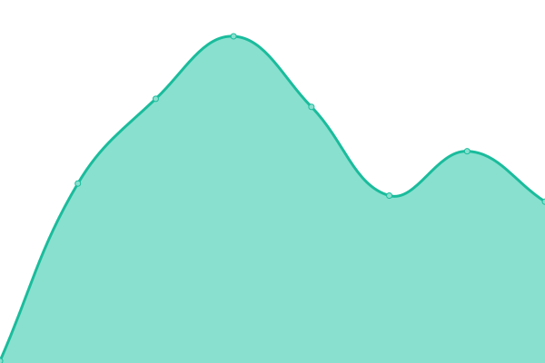

# [📈 Live Status](https://demo.statuspages.ahmadgfari.com): <!--live status--> **🟩 All systems operational**

This repository contains the open-source uptime monitor and status page for [ahmadgfari](cv.ahmadgfari.com), powered by [Upptime](https://github.com/upptime/upptime).

With [Upptime](https://upptime.js.org), you can get your own unlimited and free uptime monitor and status page, powered entirely by a GitHub repository. We use [Issues](https://github.com/ahmadgfari/upptime/issues) as incident reports, [Actions](https://github.com/ahmadgfari/upptime/actions) as uptime monitors, and [Pages](https://demo.statuspages.ahmadgfari.com) for the status page.

<!--start: status pages-->
<!-- This summary is generated by Upptime (https://github.com/upptime/upptime) -->
<!-- Do not edit this manually, your changes will be overwritten -->
<!-- prettier-ignore -->
| URL | Status | History | Response Time | Uptime |
| --- | ------ | ------- | ------------- | ------ |
|  [Rumah123](https://www.rumah123.com) | 🟩 Up | [rumah123.yml](https://github.com/ahmadgfari/uptime/commits/HEAD/history/rumah123.yml) | 

 445ms
     
 | 

<a href="https://demo.statuspages.ahmadgfari.com/history/rumah123">99.85%</a>
    

|  [99.co Indonesia](https://www.99.co/id) | 🟩 Up | [99-co-indonesia.yml](https://github.com/ahmadgfari/uptime/commits/HEAD/history/99-co-indonesia.yml) | 

 1204ms
     
 | 

<a href="https://demo.statuspages.ahmadgfari.com/history/99-co-indonesia">99.85%</a>
    

<!--end: status pages-->

[**Visit our status website →**](https://demo.statuspages.ahmadgfari.com)

## 📄 License

- Powered by: [Upptime](https://github.com/upptime/upptime)
- Code: [MIT](./LICENSE) © [ahmadgfari](cv.ahmadgfari.com)
- Data in the `./history` directory: [Open Database License](https://opendatacommons.org/licenses/odbl/1-0/)
